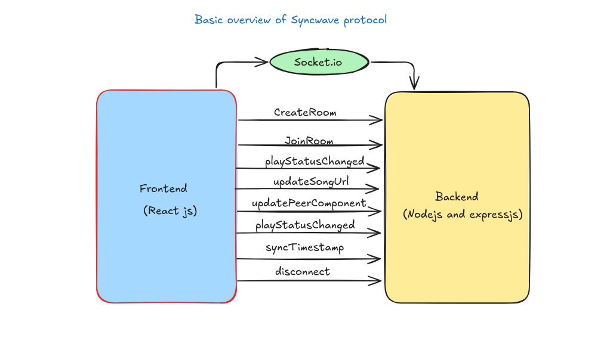
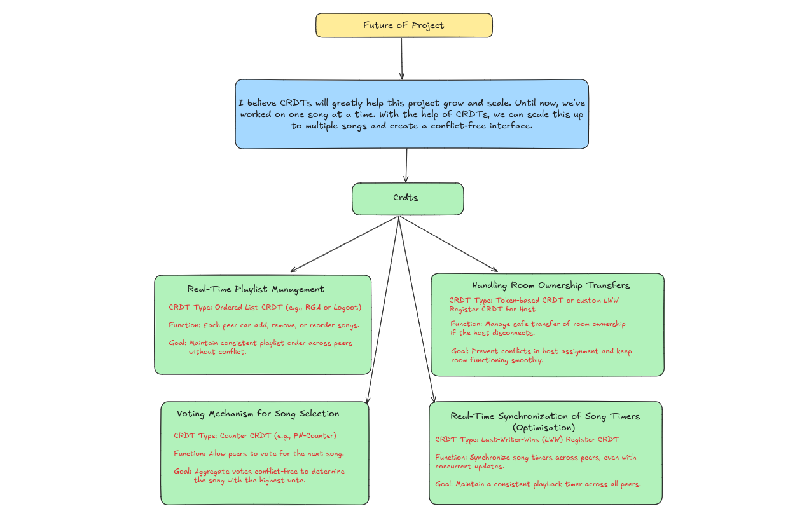

# Synctunes Backend

Synctunes is a real-time music synchronization tool that allows users to create and join rooms, share song URLs, and synchronize playback across different devices. This backend is built with Node.js and Socket.IO, providing real-time communication for a seamless music experience.

## Overview
The Synctunes backend manages user connections, room management, and real-time communication for music playback synchronization. It handles events such as creating rooms, joining rooms, updating song URLs, and synchronizing playback status.
## Backend Architecture 


## File Structure

```
controllers/
│   ├── socketController.js   # Handles socket connections and events
│   └── userController.js     # Manages user-related logic
├── db/
│   └── connection.js         # Manages database connections
├── index.js                  # Entry point for the application
├── models/
│   └── user.js               # Defines user data model
├── package.json              # Lists dependencies and project metadata
├── package-lock.json         # Locks the dependency versions
├── routes/
│   └── apiRoutes.js          # Defines API routes for handling requests
└── server.js                 # Sets up and starts the server
```

# Functionality Overview

## 1. Socket Connection
**Purpose:** Logs a message when a user connects to the server and initializes the `currentRoom` variable to keep track of the room the user is in.

## 2. createRoom
**Event:** `createRoom`
**Purpose:**
- Allows the host to create a new room.
- Checks if the room already exists; if not:
  - Initializes room data (including song URL and play status)
  - Assigns the host
  - Joins the room
- Emits the `roomCreated` and `songUrlUpdated` events to notify participants.

## 3. joinRoom
**Event:** `joinRoom`
**Purpose:**
- Lets users join an existing room.
- If the room exists:
  - Adds the user to the room
  - Initializes their peer data
  - Sends the current song URL, play status, and host ID to the newly joined user

## 4. updatePeerComponent
**Event:** `updatePeerComponent`
**Purpose:**
- Updates a peer's current playback time (`currentTime`).
- Broadcasts the updated peer information to all other peers in the room except the sender.

## 5. changeVariable
**Event:** `changeVariable`
**Purpose:**
- Listens for changes to a shared variable from clients.
- Updates the shared variable and broadcasts the new value to all clients in the room.

## 6. playStatusChanged
**Event:** `playStatusChanged`
**Purpose:**
- Updates the play status (play/pause) of the room.
- Updates the room's play status and broadcasts the change to all peers in the room.

## 7. updateSongUrl
**Event:** `updateSongUrl`
**Purpose:**
- Updates the song URL in the current room.
- Broadcasts the new song URL to all peers in the room.

## 8. syncTimestamp
**Event:** `syncTimestamp`
**Purpose:**
- Receives and stores the host's timestamp.
- Broadcasts the timestamp to all peers in the room for synchronization.

## 9. disconnect
**Event:** `disconnect`
**Purpose:**
- Handles the user disconnect event.
- Removes the user from the room's peer list, notifies others in the room about the disconnection.
- If the host disconnects:
  - Cleans up the room by deleting it
  - Notifies remaining peers

## Project Future Goals
